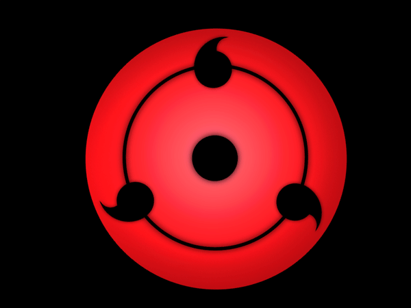

# Good day friend, I'm David (davidonlinearchive) 🌀

## About Me
I am an Offensive Security Enthusiast specializing in Web, API, and AWS Red Teaming.When I am not hunting for vulnerabilities or exploring cloud security, I am building automated infrastructure and practicing cloud engineering.

* I'm currently learning Red Team Operations
* I participate and blog some CTF Challenges here: [dev.to/davidonlinearchive](https://dev.to/davidonlinearchive)
* I enjoy writing Offensive security tools
* I'm looking to collaborate with Cyber Security Enthusiasts and Hackers

## Projects

### AWS IAM Privesc Lab (PassRole + Lambda)
A deliberately vulnerable AWS environment simulating a real-world IAM privilege escalation attack chain via `iam:PassRole` and `lambda:CreateFunction`.

**Key Features:**
* Automated deployment of vulnerable infrastructure using Terraform
* Simulates real-world cloud misconfigurations found in CI/CD pipelines
* Complete attack chain documentation from enumeration to Secrets Manager data exfiltration

**Technologies:** AWS, Terraform, Python, Pacu, enumerate-iam

**Repo:** [aws-iam-privesc-lab-passrole-lambda](https://github.com/davidonlinearchive/aws-iam-privesc-lab-passrole-lambda)
### Active Directory Pentest Lab
A virtualized offensive security environment built to simulate a corporate infrastructure. It allows for the safe execution of Kerberos-based attacks and the study of privilege escalation within a Windows domain.

**Key Features:**
* Isolated VM-to-VM communication with controlled internet access
* Integrated BloodHound and Neo4j to identify and map privilege escalation paths
* Modular design allowing for the addition of multiple Windows clients and attack nodes

**Technologies:** Windows Server 2019, BloodHound, PowerShell, Kali Linux, Impacket

**Repo:** [Active-Directory-Lab](https://github.com/davidonlinearchive/Active-Directory-Lab)

### SDirB
A web apps enumeration tool designed for rapid discovery of directories using worlists

**Key Features:**
* Utilizes Go worker pools and goroutines for performant, multi-threaded discovery
* Implemented mutex synchronization to prevent data conflicts across workers

**Technologies:** Golang, Goroutines, HTTP

**Repo:** [sdirb](https://github.com/davidonlinearchive/sdirb)

## Programming Languages
     

## Cloud and OS

     

## Socials

